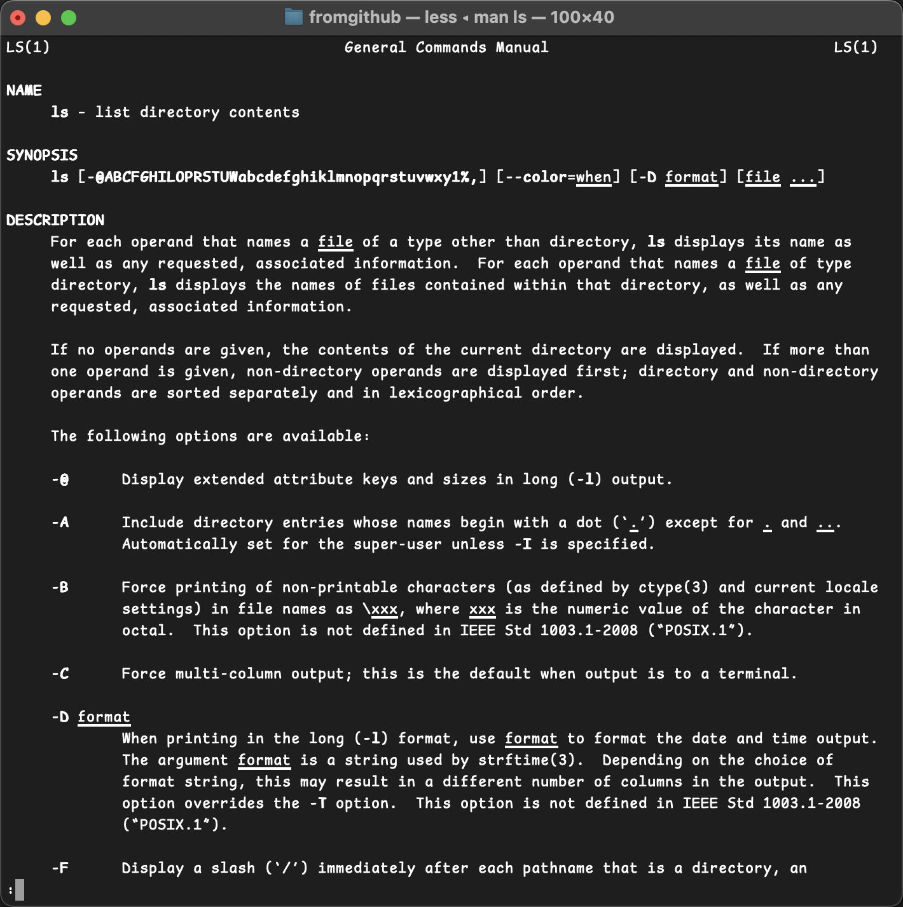
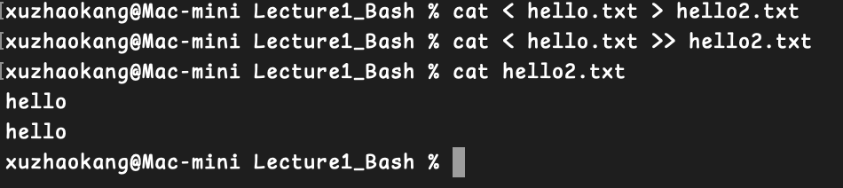
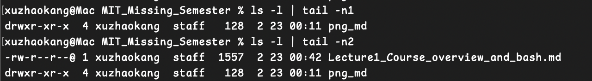
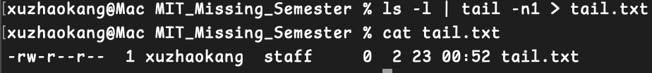

# bash command

#### 命令行参数使用空格分割
## `date`
显示当前日期时间

## `echo`
用于在终端打印文本、变量的值，或进行简单的格式化输出

## `echo $PATH`
用于显示当前系统的 PATH 环境变量，即 **可执行文件的搜索路径**

## `pwd`
(print working directory) 显示当前工作文件夹

## `.`
当前目录

## `..`
父目录

## `ls`
显示当前目录下的文件

### `ls -R`
递归列出目录结构

## `cd`  *change directory*
`cd ~` 切换到主目录，即登录时所在的目录
`cd -` 回到之前所在的目录

## `rm`
删除文件

## `mv` 
重命名: mv oldname newname
移动: mv filename /directory/......
移动至父文件夹: mv filename ..  (`..表示父文件夹`)

## `mkdir`
创建文件夹

## `rmdir`
删除文件夹

## `man`
用于查询命令对应的手册，例如 `man ls` 会显示如下图的手册: 

## `cat`
print the contents of a file
打印文件中的内容

## `< 和 >`
left angle bracket indicate rewire the input for this program to be the contents of this file and the end bracket rewire the output of the preceding program into this file
左尖括号表示将此程序的输入重新连接为此文件的内容，而右尖括号则将前一个程序的输出重新连接到此文件中
### `example:  echo hello  > hello.txt` 
将”hello“ 输出至hello.txt

### `example: cat < hello.txt > hello2.txt`
作用和 `cp hello.txt hello2.txt` 一样

### `example: cat < hello.txt >> hello2.txt`
`>>` 的作用是追加，而 `>` 是覆盖，因此这里hello.txt的内容会追加到hello2.txt
如图所示：

## `tail`
用于打印最后n行
### `example: tail -n1`
即打印最后1行

## `|` 管道符(pipe)
pipe用于将左边程序的输出作为右边命令的输入
### `example: ls -l | tail -n1`
如图所示：

### `example: ls -l | tail -n1 > tail.txt`
如图所示，将输出直接写入tail.txt

## `tee`
同时输出到标准输出（终端）和文件
### `example: echo "helloworld" | tee hello.txt`
这会在终端显示 Hello, World!，并将它写入 output.txt 文件中

参数-a可以采用追加模式写入文件 `echo "helloworld" | tee -a hello.txt` 

支持输出至多文件 `command | tee file1 file2`

