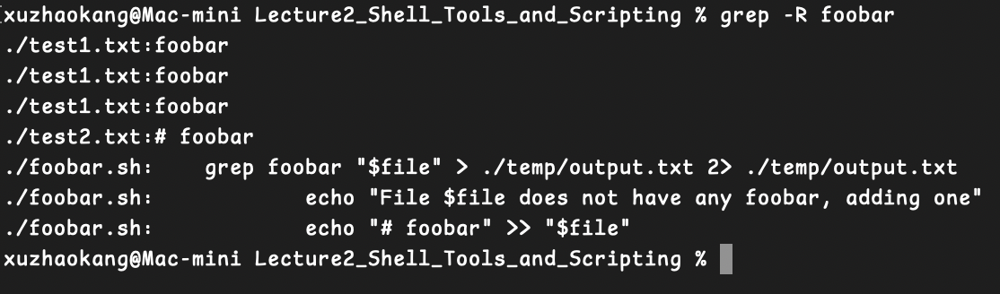

## `space` 
**空格用于分割命令**
如图所示，有空格会提示命令不存在：


---

## `"" 和 '' ` 
`""双引号` 允许拓展，如变量替换、命令替换、转义字符
`''单引号` 严格禁止拓展，完全保留原始字符串


---
## `$`
### 替换示例1
使用vim编辑一个函数 `mcd.sh` 
`vim mcd.sh` 之后按下i进入insert模式，编辑完成输入 `:wq` 保存并退出


使用 `source mcd.sh` 加载我们定义的函数，然后如图使用

此函数的作用是以传入的名称创建文件夹并cd到那个文件夹

### 替换示例2
`foo=$(pwd)` **将工作文件夹目录赋值给foo变量**


更一般的，可以使用 `echo "we are now in $(pwd)"` **注意使用双引号以支持拓展**


### 一些用法
#### `$0`
表示当前运行的脚本的名称

#### `$1 ~ $9`
表示当前脚本的第1~第9个参数
如果超过9个参数则需要使用花括号，如 `${10}`
#### `$#`
表示参数数量

#### `$_`
表示上一个命令的最后一个参数

#### `$?`
表示上一个命令的退出状态（返回值）
通常用于检查命令是否成功执行，返回 0 表示成功，非 0 值表示失败

#### `$$`
运行当前脚本的进程ID (PID)

#### `$!`
显示最近一次后台命令的PID

#### `$@`
所有传递给脚本的参数

---
## `!!`
用于引用并重新执行上一条命令
example: `mkdir /mnt/new` (可能提示permission denied)
此时可以使用 `sudo !!` 
此命令等同于 `sudo mkdir /mnt/new` 

---
## `grep`
用于查找文件中符合条件的文本行
语法: `grep content filename`
example: 


另外，可以使用参数 `-R` 检索目标文件夹下所有包含某字段的文件
example: 


---
## `true & flase`
`true` 始终返回 **成功** 状态码（退出状态码为 0）
`false` 始终返回失败的 **退出** 状态码（非零值，通常是 1）


---
## `|| 和 &&`
"或" 和 "和" 
`||` 第一个命令通过则跳过第二个，否则执行第二个
example: 


`&&` 两个命令都通过才会执行，否则都不执行
example: 


---
## `;`
`;` 是命令分隔符，表示将多个命令串联起来执行，命令在 `;` 之前执行完后会继续执行 `;` 后的命令，不管前一个命令是否成功

---

## `cat <(ls) <(ls ..)`
**`<(ls)`**：这将执行 `ls` 命令，列出当前目录的内容，并通过进程替代的方式提供一个虚拟文件路径，表示当前目录的文件列表。

**`<(ls ..)`**：这将执行 `ls ..` 命令，列出父目录的文件和目录，同样通过进程替代提供一个虚拟文件路径，表示父目录的文件列表。

**`cat <(ls) <(ls ..)`**：cat 会读取这两个虚拟文件，并将它们的内容依次输出。

---


## `*`  **通配符**
`ls *.sh` 可列出以.sh结尾的文件

---

## `{}`
用法：如果需要输入例如 `cat test1.txt test2.txt test3.txt` 可以写成 `cat test{1,2,3}.txt` 并按回车，命令行将自动补全

---

## `convert`
ImageMagick 工具集中的一个命令行工具，用于图像处理、格式转换、编辑等任务
用法示例: `convert photo1.png photo1.jpg`
这里可以用 `{}` 拓展符: `covert photo1.{png,jpg}` 

---

## 关于脚本第一行指定解释器的代码(shebang / hashbang)
在脚本的第一行，通常使用 `#!`（称为 shebang 或 hashbang）来指定解释器。对于 Bash 脚本，第一行通常是：

```bash
#!/bin/bash
```

这行代码告诉操作系统使用 `/bin/bash` 来解释和执行这个脚本。具体来说：

- `#!` 是一个特殊的标记，表示这是一个解释器指令。
- `/bin/bash` 是 Bash 解释器的路径，操作系统会使用这个路径下的 Bash 来解释和执行脚本中的命令。

如果你使用的是其他 shell 或解释器，比如 `sh`、`python` 等，你可以相应地更改路径。例如：

- 对于 `sh` 脚本：`#!/bin/sh`
- 对于 Python 脚本：`#!/usr/bin/python3`

这个第一行的代码被称为 **shebang** 或 **hashbang**。

---

## shellcheck 脚本检查工具
安装shellcheck: 

```bash
brew install shellcheck
```


此工具可用于检查脚本中存在的错误，例如提示没有指定解释器、cd存在失败可能

在文件首行指定解释器bash，并修复cd失败可能导致的错误


再次使用shellcheck检查mcd.sh


这次没有报错，说明检查通过

---

## `tldr`
`tldr` 是一个简化的命令行工具，用于快速查看常用命令的使用示例和说明。它比 `man` 页面更简洁，适合快速查阅命令的基本用法。

安装: 
```bash
brew install tldr
```

安装完成后更新目录

```bash
tldr --update
```

之后就可以正常查看了


---

## `find`

`find` 是一个功能强大的命令行工具，用于在指定目录下搜索文件和目录。它可以根据多种条件（如文件名、文件类型、文件大小、修改时间等）来查找文件，并对找到的文件执行操作。

### 基本语法
```bash
find [路径] [表达式]
```

- **路径**：指定要搜索的目录。如果不指定路径，默认从当前目录开始搜索。
- **表达式**：用于指定搜索条件和操作。表达式可以包含多个选项和操作符。

### 常用选项和表达式

1. **按文件名搜索**
   ```bash
   find /path/to/search -name "filename"
   ```
   - `-name`：按文件名搜索，支持通配符（如 `*.txt`）。

2. **按文件类型搜索**
   ```bash
   find /path/to/search -type f
   ```
   - `-type f`：搜索普通文件。
   - `-type d`：搜索目录。

3. **按文件大小搜索**
   ```bash
   find /path/to/search -size +100M
   ```
   - `-size +100M`：搜索大于100MB的文件。
   - `-size -100M`：搜索小于100MB的文件。

4. **按修改时间搜索**
   ```bash
   find /path/to/search -mtime -7
   ```
   - `-mtime -7`：搜索过去7天内修改过的文件。
   - `-mtime +7`：搜索7天前修改过的文件。

5. **执行操作**
   ```bash
   find /path/to/search -name "*.log" -exec rm {} \;
   ```
   - `-exec`：对找到的文件执行指定的命令。`{}` 表示当前找到的文件，`\;` 表示命令结束。

6. **组合条件**
   ```bash
   find /path/to/search -name "*.txt" -size +1M
   ```
   - 组合多个条件，搜索文件名以 `.txt` 结尾且大小大于1MB的文件。

### 示例

1. **查找当前目录下所有 `.txt` 文件**
   ```bash
   find . -name "*.txt"
   ```

2. **查找 `/var/log` 目录下大于100MB的文件**
   ```bash
   find /var/log -type f -size +100M
   ```

3. **查找并删除 `/tmp` 目录下7天前的 `.log` 文件**
   ```bash
   find /tmp -name "*.log" -mtime +7 -exec rm {} \;
   ```

### 注意事项
- `find` 命令非常强大，但也可能对系统造成影响，特别是在使用 `-exec` 或 `-delete` 选项时，务必小心操作。
- 在使用 `find` 时，建议先不加 `-exec` 或 `-delete`，先确认搜索结果是否正确，然后再执行操作。

通过 `find` 命令，你可以高效地管理和查找文件，尤其是在处理大量文件时非常有用。

---

## `locate`

`locate` 是一个用于快速查找文件的命令行工具。它通过搜索系统中的一个预先生成的文件数据库来查找文件，因此速度非常快。这个数据库通常由 `updatedb` 命令生成和维护。

### 基本语法
```bash
locate [选项] 文件名
```

### 常用选项

1. **基本搜索**
   ```bash
   locate filename
   ```
   - 搜索包含 `filename` 的文件路径。

2. **忽略大小写**
   ```bash
   locate -i filename
   ```
   - `-i`：忽略大小写进行搜索。

3. **限制搜索结果数量**
   ```bash
   locate -n 10 filename
   ```
   - `-n 10`：只显示前10个搜索结果。

4. **显示数据库统计信息**
   ```bash
   locate -S
   ```
   - `-S`：显示 `locate` 数据库的统计信息。

### 示例

1. **查找所有包含 `passwd` 的文件路径**
   ```bash
   locate passwd
   ```

2. **查找所有包含 `log` 的文件路径，忽略大小写**
   ```bash
   locate -i log
   ```

3. **查找所有包含 `conf` 的文件路径，只显示前5个结果**
   ```bash
   locate -n 5 conf
   ```

### 更新数据库

`locate` 命令依赖于一个预先生成的文件数据库，因此如果文件系统中有新文件添加或删除，`locate` 可能无法立即找到这些文件。为了更新数据库，可以使用 `updatedb` 命令：

```bash
sudo updatedb
```

### 注意事项

- `locate` 命令的搜索结果可能包含已经删除的文件，因为数据库可能没有及时更新。
- `locate` 命令的搜索结果可能不包含最近添加的文件，因为数据库可能没有及时更新。
- `locate` 命令的搜索结果可能包含系统文件和用户文件，因此在使用时要小心。

### 与 `find` 命令的比较

- **速度**：`locate` 比 `find` 快，因为它搜索的是一个预先生成的数据库，而不是实时搜索文件系统。
- **实时性**：`find` 是实时搜索文件系统，因此结果是最新的；而 `locate` 依赖于数据库，可能不是最新的。
- **功能**：`find` 提供了更多的搜索条件和操作选项，功能更强大；而 `locate` 主要用于快速查找文件路径。

通过 `locate` 命令，你可以快速查找文件路径，特别是在需要查找已知文件时非常有用。

---

## `ripgrep`

`rg` 是 `ripgrep` 命令的简称，它是一个非常快速且功能强大的命令行搜索工具，专门用于在文件中搜索文本模式。`ripgrep` 结合了 `grep`、`ack` 和 `ag`（The Silver Searcher）的优点，具有以下特点：

- **速度快**：`ripgrep` 使用 Rust 编写，优化了搜索算法，特别适合在大规模代码库中快速搜索。
- **默认递归搜索**：`ripgrep` 默认会递归搜索当前目录及其子目录中的所有文件。
- **智能过滤**：`ripgrep` 会自动忽略 `.gitignore` 和 `.rgignore` 文件中指定的文件和目录。
- **支持正则表达式**：支持强大的正则表达式搜索。
- **彩色输出**：搜索结果会以彩色高亮显示，便于阅读。

### 基本语法

```bash
rg [选项] 模式 [路径]
```

- **模式**：要搜索的文本或正则表达式。
- **路径**：指定要搜索的目录或文件。如果不指定路径，默认从当前目录开始递归搜索。

---

### 常用选项

1. **基本搜索**
   ```bash
   rg "search_pattern"
   ```
   - 在当前目录及其子目录中递归搜索 `search_pattern`。

2. **指定文件类型**
```bash
   rg "search_pattern" --type python
```
   - `--type`：指定文件类型（如 `python`、`js`、`markdown` 等），只搜索指定类型的文件。

3. **忽略大小写**
   ```bash
   rg -i "search_pattern"
   ```
   - `-i`：忽略大小写进行搜索。

4. **显示匹配行的上下文**
   ```bash
   rg "search_pattern" -C 3
   ```
   - `-C`：显示匹配行的上下文（前后各3行）。

5. **仅显示文件名**
   ```bash
   rg "search_pattern" -l
   ```
   - `-l`：仅显示包含匹配项的文件名，而不显示具体匹配内容。

6. **统计匹配次数**
   ```bash
   rg "search_pattern" -c
   ```
   - `-c`：统计每个文件中匹配的次数。

7. **搜索隐藏文件和目录**
   ```bash
   rg "search_pattern" --hidden
   ```
   - `--hidden`：搜索隐藏文件和目录（默认会忽略）。

8. **排除特定文件或目录**
   ```bash
   rg "search_pattern" --glob '!*.log'
   ```
   - `--glob`：使用通配符排除特定文件或目录（如 `!*.log` 排除所有 `.log` 文件）。

9. **搜索二进制文件**
   ```bash
   rg "search_pattern" --binary
   ```
   - `--binary`：搜索二进制文件（默认会忽略）。

10. **显示版本信息**
    ```bash
    rg --version
    ```

---

### 示例

1. **在当前目录中搜索 `TODO`**
   ```bash
   rg "TODO"
   ```

2. **在 `src` 目录中搜索 `error`，忽略大小写**
   ```bash
   rg -i "error" src/
   ```

3. **搜索所有 `.py` 文件中的 `import` 语句**
   ```bash
   rg "import" --type python
   ```

4. **搜索并显示匹配行的上下文**
   ```bash
   rg "function" -C 2
   ```

5. **统计 `main.js` 文件中 `console.log` 的出现次数**
   ```bash
   rg -c "console.log" main.js
   ```

6. **搜索隐藏文件中的配置**
   ```bash
   rg "config" --hidden
   ```

---

### 与 `grep` 的比较

- **速度**：`ripgrep` 通常比 `grep` 更快，尤其是在递归搜索时。
- **默认行为**：`ripgrep` 默认递归搜索，而 `grep` 需要显式指定 `-r` 选项。
- **智能过滤**：`ripgrep` 会自动忽略 `.gitignore` 中的文件，而 `grep` 需要额外配置。
- **彩色输出**：`ripgrep` 的彩色输出更直观，`grep` 需要 `--color` 选项。

---

### 总结

`ripgrep` 是一个现代化的搜索工具，特别适合开发者在代码库中快速查找文本。它的速度、易用性和强大的功能使其成为 `grep` 的绝佳替代品。如果你经常需要在文件中搜索内容，`ripgrep` 是一个非常值得尝试的工具！

---

## `history`

`history` 是一个用于查看和管理命令行历史记录的内置命令。在 `zsh` 和 `bash` 等常见的 Unix shell 中，`history` 命令可以显示你之前执行过的命令列表，并且支持对这些历史记录进行操作（如重新执行、删除等）。

### 基本用法

1. **查看历史记录**
   ```bash
   history
   ```
   - 显示当前会话中执行过的命令列表，每条命令前面会有一个编号。

2. **查看最近 N 条历史记录**
   ```bash
   history N
   ```
   - 例如，`history 10` 会显示最近 10 条命令。

3. **重新执行历史命令**
   - 使用 `!` 符号可以快速重新执行历史命令：
     - `!N`：执行编号为 `N` 的命令。
     - `!!`：执行上一条命令。
     - `!-N`：执行倒数第 `N` 条命令。
     - `!string`：执行最近一条以 `string` 开头的命令。

   **示例**：
   ```bash
   !42     # 执行编号为 42 的命令
   !!      # 重新执行上一条命令
   !-2     # 执行倒数第 2 条命令
   !git    # 执行最近一条以 `git` 开头的命令
   ```

4. **搜索历史记录**
   - 使用 `Ctrl + R` 可以反向搜索历史记录。输入关键字后，按 `Ctrl + R` 会逐步匹配历史命令。
   - 在 `zsh` 中，还可以使用 `history -i` 进行交互式搜索。

5. **删除历史记录**
   - 删除指定编号的命令：
     ```bash
     history -d N
     ```
     - 例如，`history -d 42` 会删除编号为 42 的命令。
   - 清空所有历史记录：
     ```bash
     history -c
     ```

6. **将历史记录保存到文件**
   ```bash
   history -w filename
   ```
   - 将当前历史记录保存到指定文件。

7. **从文件加载历史记录**
   ```bash
   history -r filename
   ```
   - 从指定文件加载历史记录。

---

### 常用选项

| 选项                    | 说明                                                            |
| --------------------- | ------------------------------------------------------------- |
| `history`             | 显示所有历史记录。                                                     |
| `history N`           | 显示最近 N 条历史记录。                                                 |
| `history -d N`        | 删除编号为 N 的历史记录。                                                |
| `history -c`          | 清空所有历史记录。                                                     |
| `history -w filename` | 将历史记录保存到文件。                                                   |
| `history -r filename` | 从文件加载历史记录。                                                    |
| `history -a`          | 将当前会话的历史记录追加到历史文件中（默认是 `~/.zsh_history` 或 `~/.bash_history`）。 |
| `history -n`          | 从历史文件中读取未加载的历史记录。                                             |

---

### 配置文件

- **`zsh`**：
  - 历史记录文件通常保存在 `~/.zsh_history`。
  - 可以通过设置以下变量来控制历史记录的行为（添加到 `~/.zshrc`）：
    ```bash
    HISTFILE=~/.zsh_history  # 历史记录文件路径
    HISTSIZE=1000            # 内存中保存的历史记录数量
    SAVEHIST=1000            # 历史记录文件中保存的数量
    setopt SHARE_HISTORY     # 多个终端共享历史记录
    setopt INC_APPEND_HISTORY # 实时追加历史记录
    ```

- **`bash`**：
  - 历史记录文件通常保存在 `~/.bash_history`。
  - 可以通过设置以下变量来控制历史记录的行为（添加到 `~/.bashrc`）：
    ```bash
    HISTFILE=~/.bash_history  # 历史记录文件路径
    HISTSIZE=1000             # 内存中保存的历史记录数量
    HISTFILESIZE=2000         # 历史记录文件中保存的数量
    shopt -s histappend       # 追加历史记录而不是覆盖
    ```

---

### 示例

1. **查看最近 5 条历史记录**
   ```bash
   history 5
   ```

2. **重新执行编号为 42 的命令**
   ```bash
   !42
   ```

3. **删除编号为 42 的命令**
   ```bash
   history -d 42
   ```

4. **清空所有历史记录**
   ```bash
   history -c
   ```

5. **将历史记录保存到文件**
   ```bash
   history -w my_history.txt
   ```

6. **从文件加载历史记录**
   ```bash
   history -r my_history.txt
   ```

---

### 总结

`history` 命令是一个非常实用的工具，可以帮助你快速查看、管理和重复使用之前执行过的命令。通过结合 `!` 符号和快捷键（如 `Ctrl + R`），你可以极大地提高命令行操作的效率。同时，合理配置历史记录文件（如 `~/.zsh_history` 或 `~/.bash_history`）可以确保你的命令历史在多个会话中持久化保存。

---

## `tree`
使用tree命令可以更直观地查看文件夹结构


## broot / nnn

### broot


### nnn
